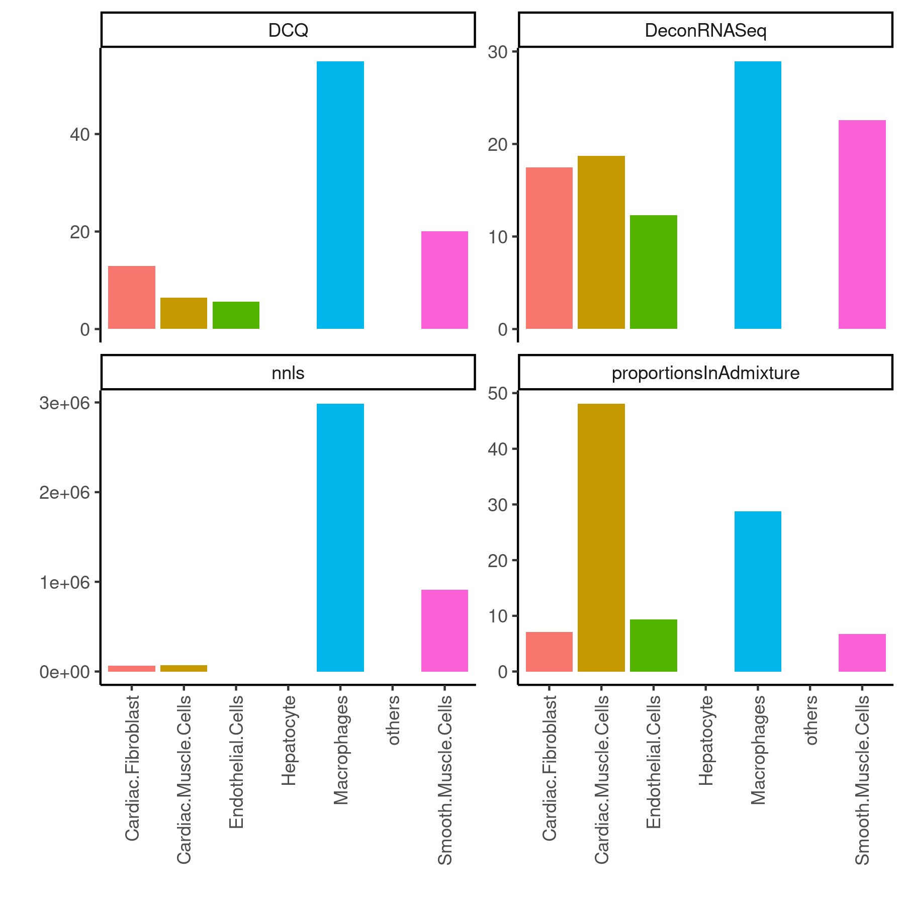
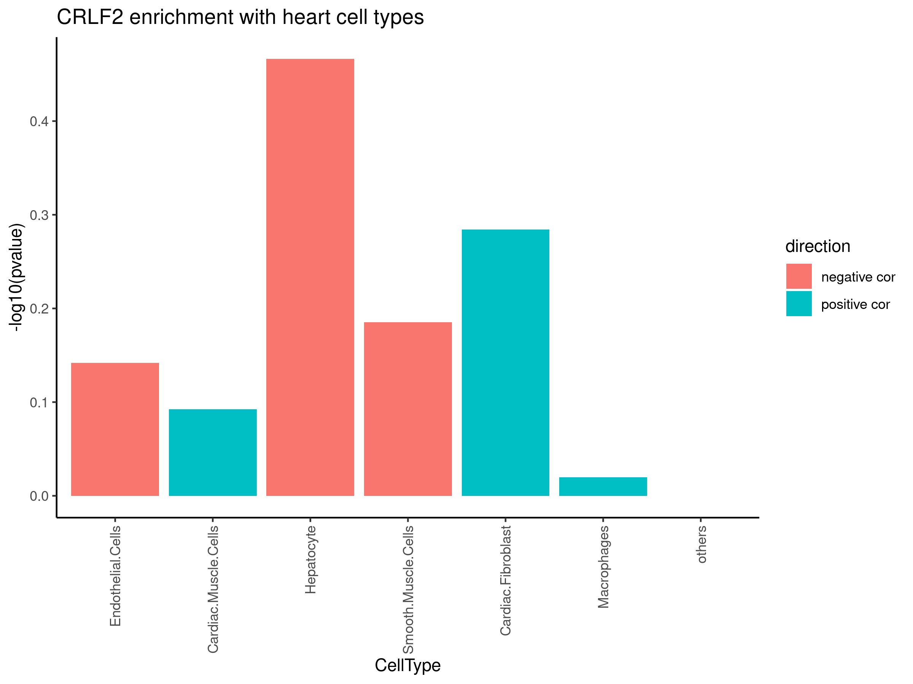
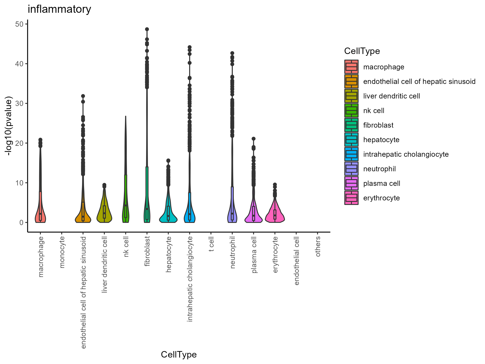
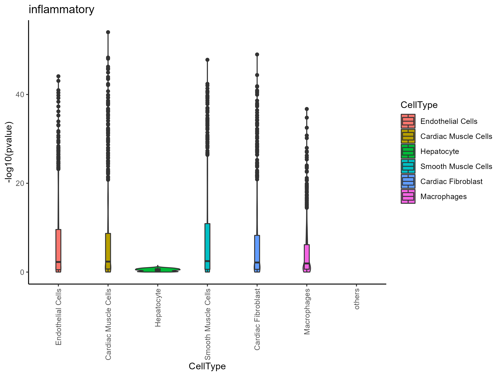
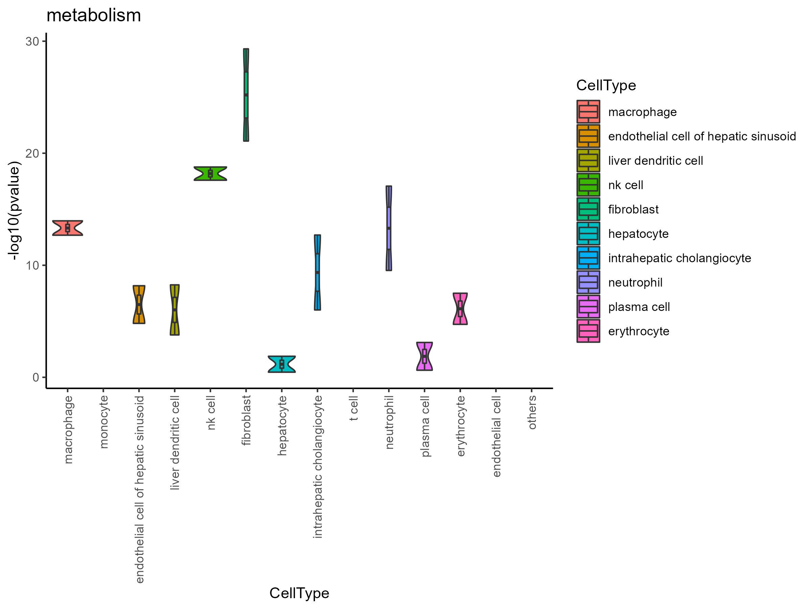
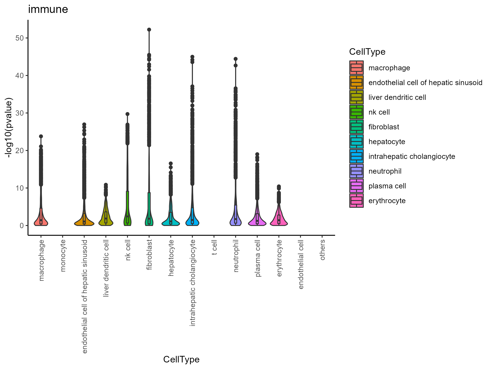

# Using deconvolution to dissect human liver and heart endocrine communication
#### Author: Cassandra Van
#### Date: December 9, 2022

## Introduction
In the body, no organ functions in isolation; instead, there is a constant symphony of organs playing inside the body where each organ is comprised of a variety of coordinated but highly diverse cell types. It follows that organs are reciprocally listening to and exerting some influence over the activation and direction of the others in order to remain in harmony, so how can we learn more about those influences? Many tissues have been sequenced for their mRNA expression as bulk datasets, providing depth into overall gene expression by using sheer numbers, and many have also been sequenced as single-cell datasets, providing specificity for each cell at decreased depth. These two modalities can be leveraged to gain further insight into the crosstalk, that is, putative endocrine communication, between cell types, tissues, and organs. Understanding this crosstalk both in more depth and from a broader view, will improve our ability to track, affect, and learn from the robust systems in the body.

## Methods
#### Datasets
Human single-cell RNA sequencing data for each tissue was obtained from Tabula Sapiens1 as direct downloads (`FinalProject_fullscript`). These datasets include cell type annotations from literature and from histology counts.

Bulk RNA sequencing data was obtained from GTEx Portal2 and formatted by Dr. Marcus Seldin, then shared with the lab as an RData workspace. It contains 1,833,286 genes measured across 452 individuals.

GO terms were obtained from Uniprot annotations and also formatted by Dr. Marcus Seldin and shared with the lab as an RData workspace.
#### Packages installed:
Seurat3, SeuratDisk4, EnrichR 5, ADAPTS6, DeconRNASeq7, WGCNA8, mclust9
#### Workflow
(`code/scripts/FinalProject_fullscript`)

Single-cell datasets were first converted to Seurat (`code/scripts/h5adtoh5seurat`) using the package `SeuratDisk` and the metadata explored using the `Seurat` package and the RStudio interface. Two categories were identified as containing cell type annotations: `SeuratObject@meta.data$free_annotation` (histology counts) and `SeuratObject@meta.data$cell_ontology_class` (literature). I decided that `SeuratObject@meta.data$free_annotation` would be more reliable in concept, but will compare to results from `SeuratObject@meta.data$cell_ontology_class` in future. I collected the annotations for future comparison using `code/scripts/h5seuratCellAnnots`, then used `code/scripts/scProcessing` to collect the normalized counts matrices, summing and averaging them by cell type so that each cell type has an expression vector.

I ran the 30 most-top-ranked genes that should define each cell type through EnrichR (`code/scripts/EnrichrCheck`), but unfortunately, while moving the code into a function, I seem to have hard-coded something so that the input data does not change between cell types, only between databases, so will require more troubleshooting (`output/figures/Enrichr_[liver, heart]`).

Bulk datasets were filtered for the tissue of interest, then only individuals with expression values over zero were used, resulting in 206 individuals for both heart and liver, with 37413 non-duplicated genes in heart and 34591 non-duplicated genes in liver (`code/scripts/bulkProcessing`).

Then both the single-cell and bulk datasets for a given tissue, were used as inputs to various deconvolution algorithms10, applied through the `ADAPTS` package (`code/scripts/ADAPTSmethods`). After reviewing the cell types estimated by the various methods, and comparing to published tissue compositions11, 12, I ended up choosing the estimates from DeconRNASeq, for both tissues as it turns out, as the most likely to be physiologically relevant.

Those deconvoluted estimates were then used to ask more biologically relevant questions, like how cell types might correlate with a given gene of interest (`code/scripts/localGOI`) and how the cell types from one tissue might correlate with the signaling in another tissue, as evidenced by GO pathway enrichment terms (`code/scripts/crossTissueGO`).

## Results
From previous work in the lab, I identified a few genes that might potentially function as endocrine communication molecules. One of these genes is CRLF2, a cytokine receptor, also called TSLPR as its ligand is TSLP, which plays a major role in acute lymphoblastic leukemia and is implicated in the development of the hematopoietic system13. From our screen, though, CRLF2 originating from the liver seemed to be correlated with changes in heart function pathways, like core contractile function and hypertrophy. This held up during both *in vitro* and *in vivo* work, so the question now is, by what mechanism does CRLF2 effect change in heart function?

Deconvoluting bulk RNA sequencing can give us the power to more reliably correlate changes in signaling with cell types and between tissues. But we must still understand that we produce only estimates that must be validated more broadly (Fig 1A-B). Looking at CRLF2 within the liver, it seems that hepatocytes are negatively correlated with CRLF2, along with a number of immune cell types, but not some others (Fig 2A). Within the heart, the cell types are not as well defined, but while I’m not sure why hepatocytes are a cell type identified in the heart single-cell dataset, the negative correlation with them is very strong (Fig 2B). In comparison, the macrophages have a slight positive correlation, but fibroblasts seem to be the only cell type more consistently positively correlated. This may point to more subtle variance in the dataset getting amplified by the transformations of the algorithms, so requires further study and comparison.

I also tried looking at how cell types might correlate across tissues in functional pathways (Fig 3A-E). While the more meaningful biological interpretation might need to wait for more technical troubleshooting of the cell type deconvolution, I think there could be much nuance gained in comparing cell types of one tissue to the expression patterns in another.

## Discussion
I used only normalized values for both my single-cell and bulk datasets, but I intend to go back through and systematically test the effect of scaling on the various possible combinations, though that also has biological implications. In my case, I mostly want to observe the effects of the ratios of the cell types, and less the specific identification of the quantities of cell types, so perhaps a relative difference of cell types is more meaningful. So perhaps more than scaling any particular dataset, applying these methods to multiple single-cell datasets might increase my power more reliably.
Overall, there are many more genes and tissues that can be queried, individually and in combination, expanding the possibility of endocrine connection between tissues.

## References
1. The Tabula Sapiens Consortium, Science 376, eabl4896 (2022)
2. Lonsdale, J., Thomas, J., Salvatore, M. et al. The Genotype-Tissue Expression (GTEx) project. Nat Genet 45, 580–585 (2013). <https://doi.org/10.1038/ng.2653>
3. Satija, R., Farrell, J., Gennert, D. et al. Spatial reconstruction of single-cell gene expression data. Nat Biotechnol 33, 495–502 (2015). <https://doi.org/10.1038/nbt.3192>
4. <https://github.com/conda-forge/r-seuratdisk-feedstock>
5. Kuleshov MV, Jones MR, Rouillard AD, Fernandez NF, Duan Q, Wang Z, Koplev S, Jenkins SL, Jagodnik KM, Lachmann A, McDermott MG,Monteiro CD, Gundersen GW, Ma’ayan A. Enrichr: a comprehensive gene set enrichment analysis web server 2016 update. Nucleic Acids Research. 2016; gkw377.
6. Danziger SA, Gibbs DL, Shmulevich I, McConnell M, Trotter MWB, et al. (2019) ADAPTS: Automated deconvolution augmentation of profiles for tissue specific cells. PLOS ONE 14(11): e0224693. <https://doi.org/10.1371/journal.pone.0224693>
7. Gong T, Szustakowski JD. DeconRNASeq: a statistical framework for deconvolution of heterogeneous tissue samples based on mRNA-Seq data. Bioinformatics. 2013 Apr 15;29(8):1083-5. doi: 10.1093/bioinformatics/btt090. Epub 2013 Feb 21. PMID: 23428642.
8. Langfelder, P., Horvath, S. WGCNA: an R package for weighted correlation network analysis. BMC Bioinformatics 9, 559 (2008). <https://doi.org/10.1186/1471-2105-9-559>
9. MCLUST Version 4 for R: Normal Mixture Modeling for Model-Based Clustering, Classification, and Density Estimation, Technical Report no. 597, Department of Statistics, University of Washington, June 2012. <https://stat.uw.edu/sites/default/files/files/reports/2012/tr597.pdf>
10. Avila Cobos, F., Alquicira-Hernandez, J., Powell, J.E. et al. Benchmarking of cell type deconvolution pipelines for transcriptomics data. Nat Commun 11, 5650 (2020). <https://doi.org/10.1038/s41467-020-19015-1>
11. Vekemans K, Braet F. Structural and functional aspects of the liver and liver sinusoidal cells in relation to colon carcinoma metastasis. World J Gastroenterol. 2005 Sep 7;11(33):5095-102. doi: 10.3748/wjg.v11.i33.5095. PMID: 16127736; PMCID: PMC4320379.
12. Alexander R. Pinto, Alexei Ilinykh, Malina J. Ivey, Jill T. Kuwabara, Michelle L. D’Antoni, Ryan Debuque, Anjana Chandran, Lina Wang, Komal Arora, Nadia A. Rosenthal, and Michelle D. Tallquist. Revisiting Cardiac Cellular Composition. Circulation Research. 2016;118:400–409 <https://doi.org/10.1161/CIRCRESAHA.115.307778>
13. <https://www.genecards.org/cgi-bin/carddisp.pl?gene=CRLF2>
