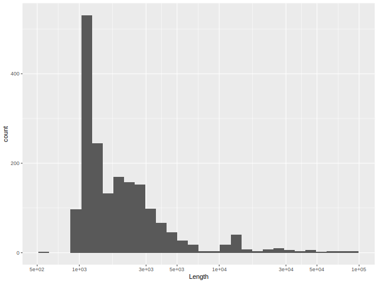
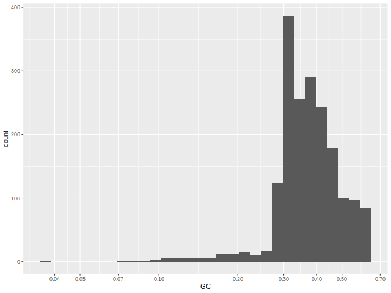
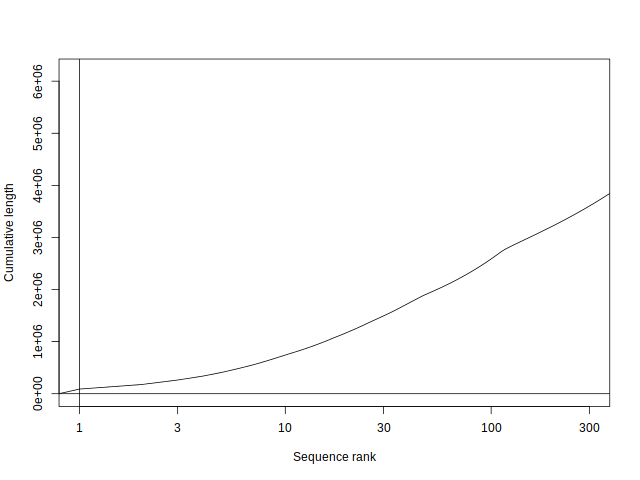
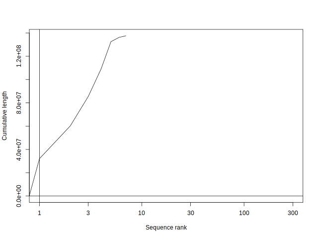
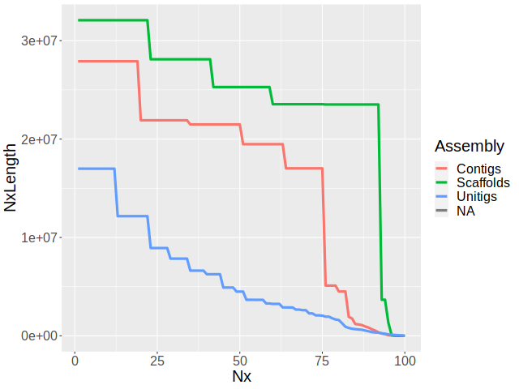
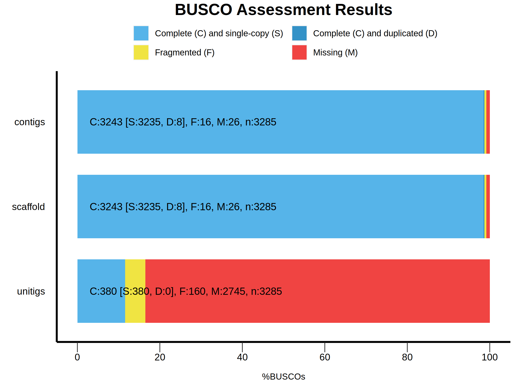

# Homework 4: Pipelines, Genome Assembly
###### Author: Cassandra Van
###### Date: December 5, 2022

## **Partitions of a genome (&le;100kb and &gt;100kb)**

### Summaries

##### Sequences &le;100kb:
1. Total number of nucleotides = 6178042
2. Total number of Ns = 662563
3. Total number of sequences = 1863

##### Sequences &gt;100kb:
1. Total number of nucleotides = 137547960
2. Total number of Ns = 490385
3. Total number of sequences = 7

### Plots

##### Sequences &le;100kb:
1. Sequence length distribution:

2. Sequence GC% distribution:

3. Cumulative length distribution:

###### Sequences &gt;100kb:
1. Sequence length distribution:

2. Sequence GC% distribution:

3. Cumulative length distribution:

## **Genome assembly**

#### Assembly with `minimap2` and `miniasm`
I was unable to get `minimap2` and `miniasm` to work together; instead I used `minimap`, where the values calulated seemed the same, but the formatting was something `miniasm` was able to parse to collect the sequences for assembly.

#### Assembly assessment
1. N50 of my assembly = 4494246. That is, the contigs larger than the contig of size 4,494,246 capture at least 50% of the assembly volume. Compared to the _Drosophila_ community reference of 21,485,538, it falls far short.
2. Contiguity plot comparing the assemblies:

3. BUSCO score comparison:

Both the contiguity plot and the BUSCO score plot confirm that my unitig assembly is far less comprehensive compared to the _Drosophila_ community's reference assembly.
